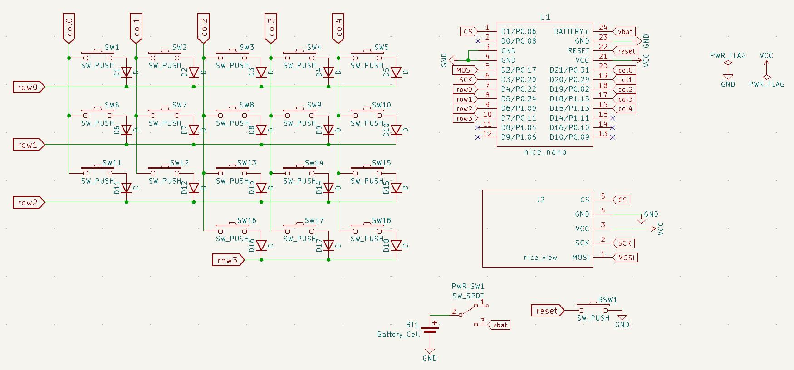

# temper PCB

This folder houses all of the KiCAD files for the temper PCB.

This PCB is designed to be reversible--this means that it can function as either the left or the right half, depending on which side the assembler solders the jumpers and parts.

For this to work, the schematic was designed for one half of the keyboard, as in the image above. Then, I laid out the board using reversible footprints (see resources in [main README](../README.md)).
